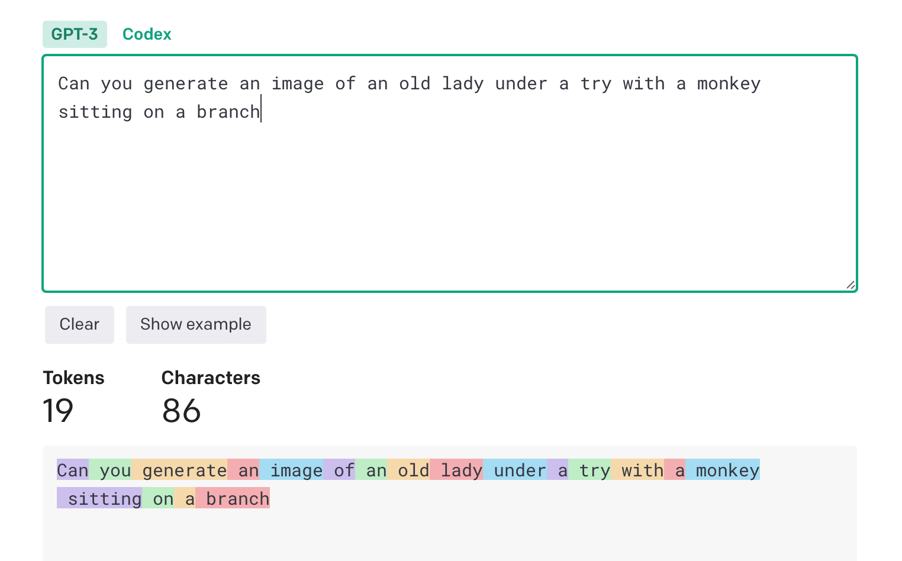

# Pricing overview

[Tokenizer] tool to help understand how much token it takes to run a transaction. 

More about [tokens](https://www.youtube.com/watch?v=CQCnmsyl61Q)

Discussion points:
- comma separated values may cost more than tab or space separated values. 
- Approximately 1 tokens per 4 characters
- 
